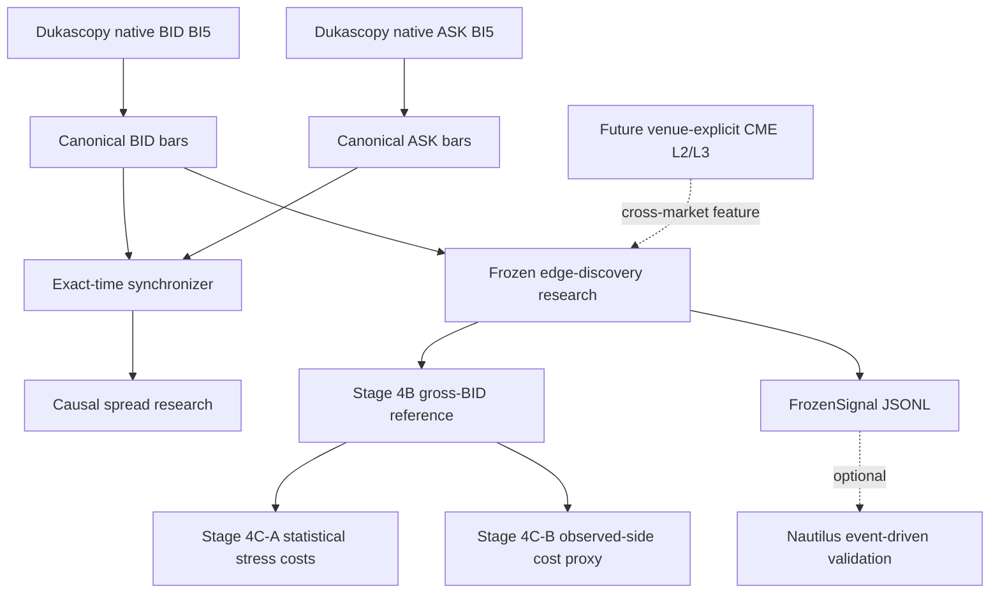

# MR Lab V2: experimental research architecture

MR Lab V2 is an additive experimental fork. It does not change the frozen Stage
2/3 calculations, Stage 4A event diagnostics, Stage 4B gross-BID simulator, or
Stage 4C-A statistical stress transform. The protected 2025 holdout remains
unavailable; direct daily acquisition now rejects that year before any network
operation.

## Data and spread semantics

Dukascopy exposes BID and ASK candles as distinct side-specific paths. V2 makes
the side an input to URL construction, decoding, canonical metadata, file names,
and identities. Legacy BID entry points and their identities are deliberately
unchanged. ASK is never synthesized from BID.

Synchronization is an exact outer join on canonical M1 open time. It does not
forward-fill. Every row is classified as synchronized, BID-only, ASK-only,
crossed, or zero-spread, and gaps are counted. Only a synchronized positive
quote exposes `spread_price`, `spread_pips`, and midpoint-denominated
`spread_bps`. Its `available_at` is the later availability of the two inputs.

Rolling spread percentile, relative median, expansion, and optional causal
volatility-shock context use only the current prefix. Summaries retain sample
and unavailable counts, coverage, instrument, session, and methodology ID; they
are descriptive and unranked. Session/time-of-day and signal-window studies are
formed by filtering these timestamped features, never by injecting final
session or day statistics backward.

## Execution-realism layers

* **Stage 4B** remains the deterministic gross-BID reference simulator.
* **Stage 4C-A** remains the frozen mean/p75/p90/p95 spread plus hypothetical
  slippage stress transform.
* **Stage 4C-B** prices a long entry at observed ASK and exit at observed BID;
  a short enters at BID and exits at ASK. Exact absent, one-sided, or anomalous
  quotes make the result unavailable rather than filled.

Stage 4C-B intentionally labels TP/SL path consistency unavailable. Applying a
different entry side can alter whether a target was reached, while completed M1
candles do not reveal tick ordering. Consequently V2 does not present a
post-hoc cost transform as a pathwise resimulation.

> **Dukascopy historical spread is not an FTMO/cTrader fill model.** It is a
> better historical market-cost proxy than a constant assumption, not ground
> truth for another venue, account, queue, latency, commission, or slippage.

## Causal structure family

The first deliberately small family contains confirmed swing highs/lows and
trailing-extreme sweep/reclaims. A swing candidate's `event_time` is its own bar,
but `available_at` is the close of the final required confirmation bar. Reclaims
compare the current completed candle only with a fixed trailing prefix. Terms
such as order block, displacement, fair-value gap, BOS, and CHoCH are excluded
until a predeclared unambiguous causal definition exists. These features are
contexts for conditional MR studies, not asserted edges or optimizer inputs.

## Independent validation

`providers.oracle.compare_bars` compares bounded locally decoded bars with an
already-produced independent reference by timestamp, OHLC, counts, and missing
rows. It permits fixtures exported by `duka-data` or `dukascopy-node`, but the
production engine has no Node.js or external-repository dependency. No external
verification is claimed by unit tests; a real bounded BID/ASK comparison still
requires running an independent decoder and recording its version and source
payload identity.

## Future microstructure and Nautilus boundaries

Venue-explicit immutable L1/L2-market-by-price/L3-market-by-order specifications
and snapshots prevent a Dukascopy quote from masquerading as a centralized book.
CME FX futures depth would be a **cross-market information source**, not the
FTMO/cTrader spot/CFD execution venue. No L2/L3 data is fabricated or bundled.

The optional Nautilus boundary is deterministic JSONL of frozen MR signals and
their strategy/dataset identities. It imports no Nautilus package. MR Lab remains
the research authority; future event-driven replay is an independent validation
model rather than a replacement engine.

## Known limitations

Observed candle closes are not executable tick quotes; intraminute BID/ASK path
and ordering remain unknown. Broker-specific markups, commissions, latency,
slippage, rejects, and queue position are absent. The current synchronizer is
intentionally strict and does not perform tolerance/as-of joins. Real independent
decoder validation, broker data, CME depth, and a full Nautilus replay remain
external work. None of those limitations authorizes touching the 2025 holdout.
